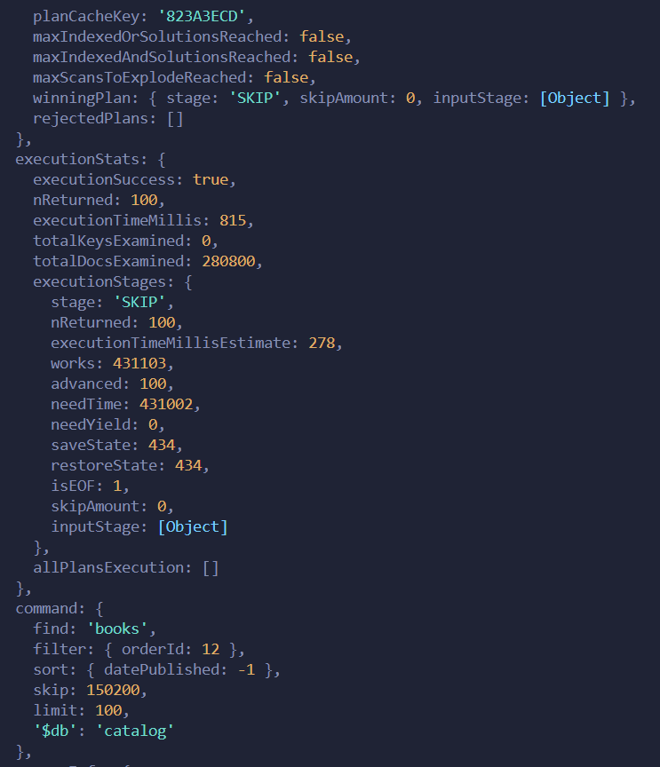
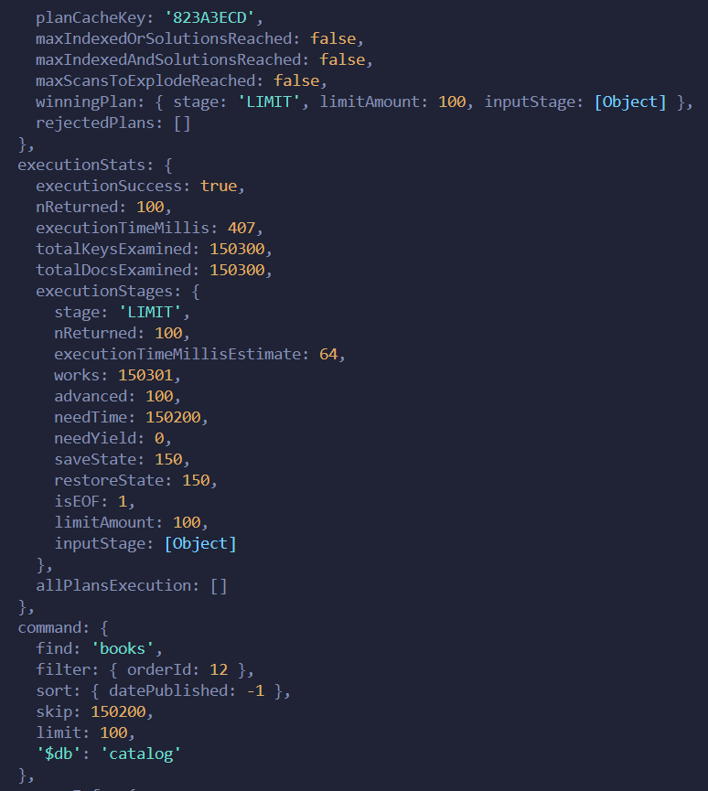

# Book Shop Mickroservice

- [General info](#general-info)
- [Api-docs](#api-docs)
- [Experiments](#experiments)
- [Technologies](#technologies)
- [Set-up](#set-up)

## General Info

The domain model in the project is described by three entities `Order`, `Customer `and `Book`.

## Experiments

To avoid sorting all the collection items in memory and to speed up the query, I added an index on the datePublished field.
To compare the performance, I took screenshots:

1. Without Index:

   

2. With Index:

   

## Technologies

- Nodejs (Express)

- MongoDB

- Docker

- Integration Test

## Set-up
- run mongodb in docker container (docker-compose up -d)
- run app (npm run start)
